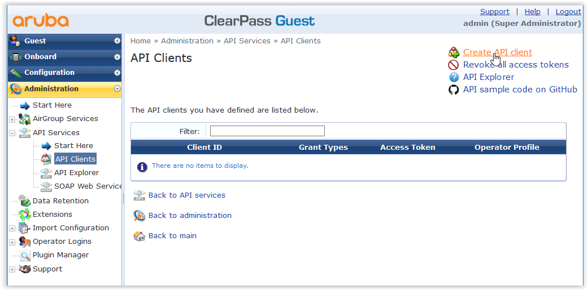
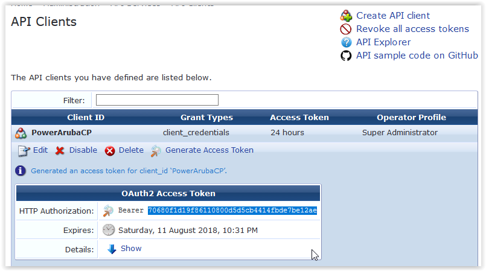

# PowerArubaCP

This is a Powershell module for configure a Aruba ClearPass (CPPM).

With this module (version 0.2.0) you can manage:

- Network Device (Add / Get / Remove a NAS)
- Invoke API using Invoke-ArubaCPRestMethod

More functionality will be added later.

Tested with Aruba ClearPass (using release 6.7.x)

# Usage

All resource management functions are available with the Powershell verbs GET, ADD, SET, REMOVE. 
For example, you can manage NAS (NetworkDevice) with the following commands:
- `Get-ArubaCPNetworkDevice`
- `Add-ArubaCPNetworkDevice`
<!--- `Set-ArubaSWVlans`-->
- `Remove-ArubaCPNetworkDevice`

# Requirements

- Powershell 5 or 6 (Core) (If possible get the latest version)
- A ClearPass (with release 6.7.x) and API Client enable

# Instructions
### Install the module
```powershell
# Automated installation (Powershell 5):
    Install-Module PowerArubaCP

# Import the module
    Import-Module PowerArubaCP

# Get commands in the module
    Get-Command -Module PowerArubaCP

# Get help
    Get-Help Add-ArubaCPArubaNetwork -Full
```

# Examples

### Connecting to the ClearPass using API

The first thing to do is to get API Client Token

Go on WebGUI of your ClearPass, on Guest Modules
  
Go on `Adminstration` => `API Services` => `API Clients`

  
Create a `New API Client`
- Client ID : a client name (for example PowerArubaCP)
- Operator Profile : Super Administrator
- Grant type : Client credentials
- Access Token Lifetime : You can increment ! (24 hours !)

Click on `Create API Client` (you don't need to store the Client Secet)

On `API Clients List`, select the your client
  

Click on `Generate Access Token`

  
And kept the token (for example : 70680f1d19f86110800d5d5cb4414fbde7be12ae)


After connect to a Aruba ClearPass with the command `Connect-ArubaCP` :

```powershell
# Connect to the Aruba Clearpass
    Connect-ArubaCP 192.0.2.1 -token 70680f1d19f86110800d5d5cb4414fbde7be12ae

```

### Invoke API
for example to get ClearPass version

```powershell
# get ClearPass version using API
    Invoke-ArubaCPRestMethod -method "get" -uri "api/cppm-version"

    app_major_version   : 6
    app_minor_version   : 7
    app_service_release : 2
    app_build_number    : 105008
    hardware_version    : CLABV
    fips_enabled        : False
    eval_license        : False
    cloud_mode          : False
```

if you get a warning about `Unable to connect` Look [Issue](#Issue)

to get API uri, go to ClearPass Swagger (https://CPPM-IP/api-docs)
  

And choice a service (for example Platform)
  

### NAS Management

You can create a new NAS `Add-ArubaCPNetworkDevice`, retrieve its information `Get-ArubaCPNetworkDevice`,<!-- modify its properties `Set-ArubaSWVLans`,--> or delete it `Remove-ArubaCPNetwork`.

```powershell
# Create a NAS
    Add-ArubaCPNetworkDevice -name SW1 -ip_address 192.0.2.1 -radius_secret MySecurePassword -vendor Aruba -description "Add by PowerArubaCP"

    id            : 3004
    name          : SW1
    description   : Add by PowerArubaCP
    ip_address    : 192.0.2.1
    radius_secret :
    tacacs_secret :
    vendor_name   : Aruba
    coa_capable   : False
    coa_port      : 3799
    attributes    :
    _links        : @{self=}


# Get information about NAS
    Get-ArubaCPNetworkDevice -name SW1 | Format-Table

    id   name description         ip_address radius_secret tacacs_secret vendor_name coa_capable coa_port attributes
    --   ---- -----------         ---------- ------------- ------------- ----------- ----------- -------- ----------
    3004 SW1  Add by PowerArubaCP 192.0.2.1                              Aruba       False       3799

# Remove a NAS
    $nad = Get-ArubaCPNetworkDevice -name SW1
    $nad | Remove-ArubaCPNetworkDevice -noconfirm
```

### Disconnecting

```powershell
# Disconnect from the Aruba ClearPass
    Disconnect-ArubaCP
```

# Issue

## Unable to connect (certificate)
if you use `Connect-ArubaCP` and get `Unable to Connect (certificate)`

The issue coming from use Self-Signed or Expired Certificate for switch management

Try to connect using `Connect-ArubaCP -SkipCertificateCheck`

# List of available command
```powershell
Add-ArubaCPNetworkDevice
Connect-ArubaCP
Disconnect-ArubaCP
Get-ArubaCPNetworkDevice
Invoke-ArubaCPRestMethod
Remove-ArubaCPNetworkDevice
Set-ArubaCPCipherSSL
Set-ArubaCPuntrustedSSL
```

# Author

**Alexis La Goutte**
- <https://github.com/alagoutte>
- <https://twitter.com/alagoutte>

# Special Thanks

- Warren F. for his [blog post](http://ramblingcookiemonster.github.io/Building-A-PowerShell-Module/) 'Building a Powershell module'
- Erwan Quelin for help about Powershell

# License

Copyright 2018 Alexis La Goutte and the community.
