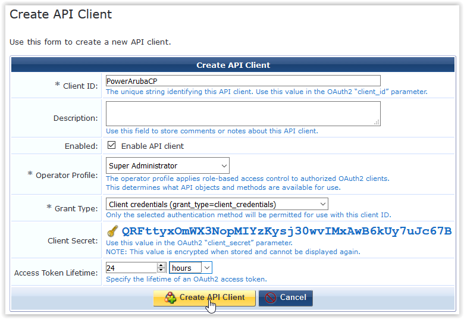
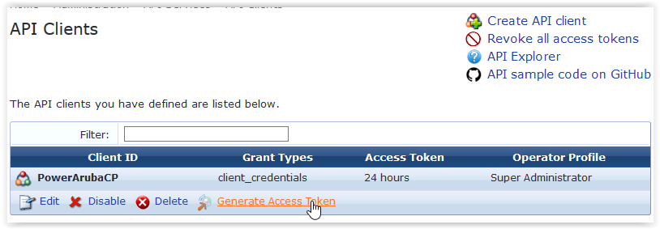

Last release: [](https://badge.fury.io/gh/PowerAruba/powerarubacp)

# PowerArubaCP

This is a Powershell module for configure a Aruba ClearPass (CPPM).

With this module (version 0.1.0) you can manage:

- Invoke API using Invoke-ArubaCPRestMethod

More functionality will be added later.

Tested with Aruba ClearPass (using release 6.7.x)

# Usage

All resource management functions are available with the Powershell verbs GET, ADD, SET, REMOVE. 
<!-- For example, you can manage Vlans with the following commands:
- `Get-ArubaSWVlans`
- `Add-ArubaSWVlans`
- `Set-ArubaSWVlans`
- `Remove-ArubaSWVlans`
-->

# Requirements

- Powershell 5 or 6 (Core) (If possible get the latest version)
- A ClearPass (with release 6.7.x) and API Client enable

# Instructions
### Install the module
```powershell
# Automated installation (Powershell 5):
    Install-Module PowerArubaCP

# Import the module
    Import-Module PowerArubaCP

# Get commands in the module
    Get-Command -Module PowerArubaCP

# Get help
    Get-Help Connect-ArubaCP -Full
```

# Examples

### Connecting to the ClearPass using API

The first thing to do is to get API Client Token

Go on WebGUI of your ClearPass, on Guest Modules
  
Go on `Adminstration` => `API Services` => `API Clients`

  
Create a `New API Client`
- Client ID : a client name (for example PowerArubaCP)
- Operator Profile : Super Administrator
- Grant type : Client credentials
- Access Token Lifetime : You can increment ! (24 hours !)

Click on `Create API Client` (you don't need to store the Client Secet)

On `API Clients List`, select the your client
  

Click on `Generate Access Token`

  
And kept the token (for example : 70680f1d19f86110800d5d5cb4414fbde7be12ae)


After connect to a Aruba ClearPass with the command `Connect-ArubaCP` :

```powershell
# Connect to the Aruba Clearpass
    Connect-ArubaCP 192.0.2.1 -token 70680f1d19f86110800d5d5cb4414fbde7be12ae

```

### Invoke API
for example to get ClearPass version

```powershell
# get ClearPass version using API
    Invoke-ArubaCPRestMethod -method "get" -uri "api/cppm-version"

    app_major_version   : 6
    app_minor_version   : 7
    app_service_release : 2
    app_build_number    : 105008
    hardware_version    : CLABV
    fips_enabled        : False
    eval_license        : False
    cloud_mode          : False
```
to get API uri, go to ClearPass Swagger (https://CPPM-IP/api-docs)
  

And choice a service (for example Platform)
  

<!--
### NAD Management

You can create a new LUN `Add-ArubaSWVlans`, retrieve its information `Get-ArubaSWVlans`, modify its properties `Set-ArubaSWVLans`, or delete it `Remove-ArubaSWVlans`.

```powershell
# Create a vlan
    Add-ArubaSWVlans -id 85 -Name 'PowerArubaSW' -is_voice_enabled

    uri               : /vlans/85
    vlan_id           : 85
    name              : PowerArubaSW
    status            : VS_PORT_BASED
    type              : VT_STATIC
    is_voice_enabled  : False
    is_jumbo_enabled  : True
    is_dsnoop_enabled : False


# Get information about vlan
    Get-ArubaSWVlans -name PowerArubaSW | ft

    uri       vlan_id name         status        type      is_voice_enabled is_jumbo_enabled is_dsnoop_enabled is_management_vlan
    ---       ------- ----         ------        ----      ---------------- ---------------- ----------------- ------------------
    /vlans/85      85 PowerArubaSW VS_PORT_BASED VT_STATIC            False             True             False              False


# Remove a vlan
    Remove-ArubaSWVlans -id 85
```
-->

### Disconnecting

```powershell
# Disconnect from the Aruba ClearPass
    Disconnect-ArubaCP
```

# Author

**Alexis La Goutte**
- <https://github.com/alagoutte>
- <https://twitter.com/alagoutte>

# Special Thanks

- Warren F. for his [blog post](http://ramblingcookiemonster.github.io/Building-A-PowerShell-Module/) 'Building a Powershell module'
- Erwan Quelin for help about Powershell

# License

Copyright 2018 Alexis La Goutte and the community.
